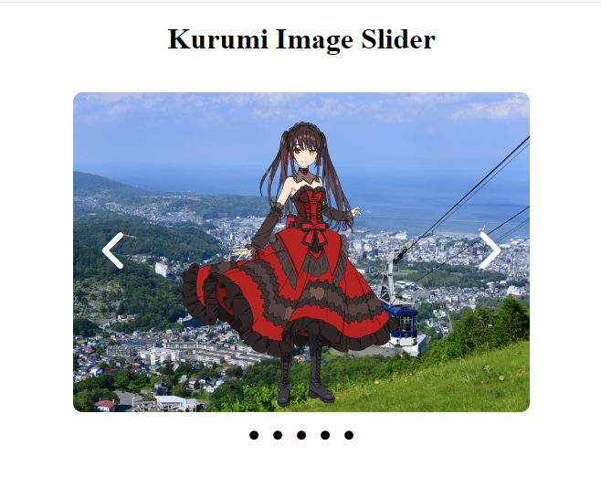

# React Image Slider

This is an image slider made with React.  
It utilizes various React hooks such as `useState`, `useEffect`, `useRef`, and `useCallback` to create an interactive image slider that switches slides on its own after a certain interval.

    <strong>
        <h2>Preview: </h2>
    </strong>

    

All images used are available under the [creative commons license](https://creativecommons.org/share-your-work/cclicenses/)
